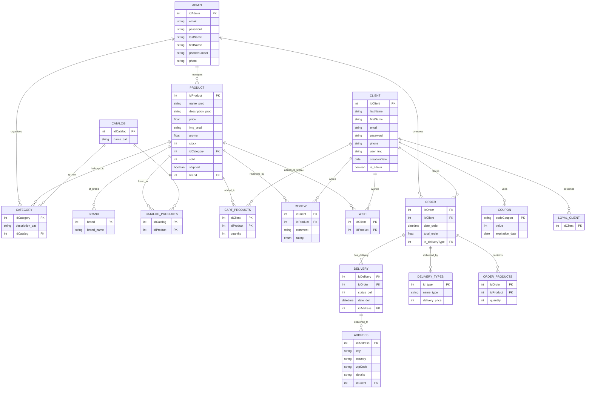

```mermaid
erDiagram
    %% Product Catalog Section
    CATALOG {
        int idCatalog PK
        string name_cat
    }
    CATEGORY {
        int idCategory PK
        string description_cat
        int idCatalog FK
    }
    PRODUCT {
        int idProduct PK
        string name_prod
        string description_prod
        float price
        string img_prod
        float promo
        int stock
        int idCategory FK
        int sold
        boolean shipped
        int brand FK
    }
    BRAND {
        int brand PK
        string brand_name
    }
    CATALOG_PRODUCTS {
        int idCatalog PK
        int idProduct PK
    }
    CATALOG ||--o{ CATEGORY : "groups"
    CATALOG ||--o{ CATALOG_PRODUCTS : "lists"
    PRODUCT ||--o{ CATEGORY : "belongs_to"
    PRODUCT ||--o{ CATALOG_PRODUCTS : "listed_in"
    PRODUCT ||--o{ BRAND : "of_brand"

    %% Shopping Cart Section
    CLIENT {
        int idClient PK
        string lastName
        string firstName
        string email
        string password
        string phone
        string user_img
        date creationDate
        boolean is_admin
    }
    CART_PRODUCTS {
        int idClient PK
        int idProduct PK
        int quantity
    }
    CLIENT ||--o{ CART_PRODUCTS : "adds_to_cart"
    PRODUCT ||--o{ CART_PRODUCTS : "added_to"

    %% Rating & Review Section
    REVIEW {
        int idClient PK
        int idProduct PK
        string comment
        enum rating
    }
    WISH {
        int idClient PK
        int idProduct PK
    }
    CLIENT ||--o{ REVIEW : "writes"
    CLIENT ||--o{ WISH : "wishes"
    PRODUCT ||--o{ REVIEW : "reviewed_by"
    PRODUCT ||--o{ WISH : "added_to_wish"

    %% Order and Delivery Section
    ORDER {
        int idOrder PK
        int idClient FK
        datetime date_order
        float total_order
        int id_deliveryType FK
    }
    DELIVERY {
        int idDelivery PK
        int idOrder FK
        int status_del
        datetime date_del
        int idAddress FK
    }
    DELIVERY_TYPES {
        int id_type PK
        string name_type
        int delivery_price
    }
    ADDRESS {
        int idAddress PK
        string city
        string country
        string zipCode
        string details
        int idClient FK
    }
    ORDER_PRODUCTS {
        int idOrder PK
        int idProduct PK
        int quantity
    }
    CLIENT ||--o{ ORDER : "places"
    ORDER ||--o{ ORDER_PRODUCTS : "contains"
    ORDER ||--o{ DELIVERY : "has_delivery"
    ORDER ||--o{ DELIVERY_TYPES : "delivered_by"
    DELIVERY ||--o{ ADDRESS : "delivered_to"

    %% Payment & Loyalty Section
    COUPON {
        string codeCoupon PK
        int value
        date expiration_date
    }
    LOYAL_CLIENT {
        int idClient PK
    }
    CLIENT ||--o{ LOYAL_CLIENT : "becomes"
    CLIENT ||--o{ COUPON : "uses"

    %% Administration Section
    ADMIN {
        int idAdmin PK
        string email
        string password
        string lastName
        string firstName
        string phoneNumber
        string photo
    }
    ADMIN ||--o{ PRODUCT : "manages"
    ADMIN ||--o{ CATEGORY : "organizes"
    ADMIN ||--o{ ORDER : "oversees"

```