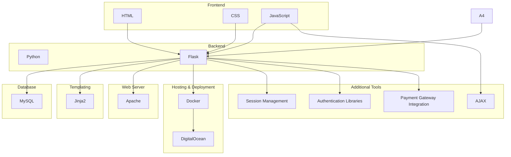

```mermaid
graph TD
    subgraph Frontend
        A1[HTML]
        A2[CSS]
        A3[JavaScript]
    end

    subgraph Backend
        B1[Python]
        B2[Flask]
    end

    subgraph Database
        C1[MySQL]
    end

    subgraph Templating
        D1[Jinja2]
    end

    subgraph Web Server
        E1[Apache]
    end

    subgraph Hosting & Deployment
        F1[DigitalOcean]
        F2[Docker]
    end

    subgraph Additional Tools
        G1[AJAX]
        G2[Session Management]
        G3[Authentication Libraries]
        G4[Payment Gateway Integration]
    end

    A1 --> B2
    A2 --> B2
    A3 --> B2
    A4 --> B2
    B2 --> C1
    B2 --> D1
    B2 --> E1
    B2 --> F2
    F2 --> F1
    A3 --> G1
    B2 --> G2
    B2 --> G3
    B2 --> G4
```